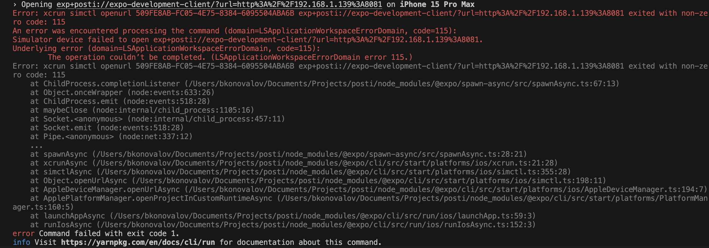

# Posti

Post browsing mobile application built using React Native.

## Getting Started

- Install the dependencies:

  ```sh
  yarn install
  ```

- Start the development server:

  ```sh
  yarn start
  ```

- Build and run iOS and Android development builds:

  ```sh
  yarn ios
  # or
  yarn android
  ```

## Notes

This project uses a [development build](https://docs.expo.dev/develop/development-builds/introduction/) and cannot be run with [Expo Go](https://expo.dev/go). To run the app with Expo Go, edit the `package.json` file, remove the `expo-dev-client` package and `--dev-client` flag from the `start` script. However, Edge-to-edge won't work on Expo Go.

It's highly recommended using the development builds for normal development and testing.

The `ios` and `android` folder are gitignored in the project by default as they are automatically generated during the build process ([Continuous Native Generation](https://docs.expo.dev/workflow/continuous-native-generation/)). This means that you should not edit these folders directly and use [config plugins](https://docs.expo.dev/config-plugins/) instead. However, if you need to edit these folders, you can remove them from the `.gitignore` file so that they are tracked by git.

## Troubleshooting

If occasionally after `yarn ios` / `yarn android` command you see this error and the app was installed:



Just run `yarn start` and open the installed app.

## Resources

- [React Navigation documentation](https://reactnavigation.org/)
- [Expo documentation](https://docs.expo.dev/)
- [Redux toolkit documentation](https://redux-toolkit.js.org/)

---

Developed by [Bohdan Konovalov](https://github.com/bohdan-konovalov)
